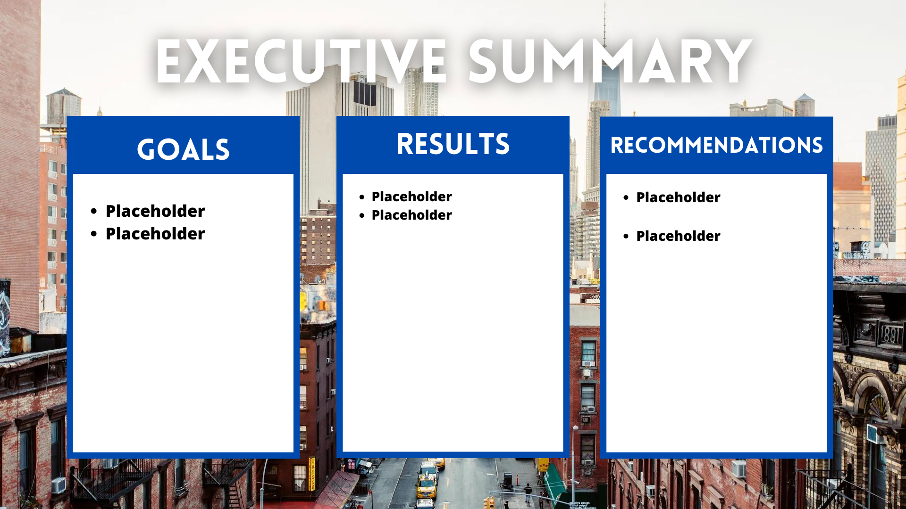

## Project Description:

This project aims to provide NYC teachers with a comprehensive understanding of their expected annual salary growth, factoring in the impact of United Federation of Teachers salary contracts from 2014 to 2023. By offering insights into the relationship between salary contracts and individual compenstation the objective is to empower teachers to improve their financial well-being and evaluate the value they receive from UFT-negotiated contracts.

## Table of Contents:

    Project Charter
    Getting Started
    Data Sources
    Data Dictionary
    Data Cleaning
    Analysis
    Results
    Visualizations
    License
    Acknowledgments

### Getting Started:
To get started with this project, follow these steps:

1. Clone the repository to your local machine:

    ```bash
    git clone https://github.com/your-username/your-project.git
    ```

2. Navigate to the project directory:

    ```bash
    cd your-project
    ```

3. Create a virtual environment (optional but recommended):

    ```bash
    python3 -m venv venv
    ```

4. Activate the virtual environment:

    - On Windows:

        ```bash
        venv\Scripts\activate
        ```

    - On macOS and Linux:

        ```bash
        source venv/bin/activate
        ```

5. Install the required Python libraries:

    ```bash
    pip install -r requirements.txt
    ```

6. Download the dataset from [Data Source](https://data.cityofnewyork.us/City-Government/Citywide-Payroll-Data-Fiscal-Year-/k397-673e/about_data) and place it in the project directory.

7. You're now ready to run the project! Open the main notebook or script and follow the instructions provided for data analysis, visualization, etc.

### Data Dictionary

| Column Name              | Description                                            | Type       |
|--------------------------|--------------------------------------------------------|------------|
| Fiscal Year              | Fiscal Year                                            | Number     |
| Payroll Number           | Payroll Number                                         | Number     |
| Agency Name              | The Payroll agency that the employee works for         | Plain Text |
| Last Name                | Last name of employee                                  | Plain Text |
| First Name               | First name of employee                                 | Plain Text |
| Mid Init                 | Middle initial of employee                             | Plain Text |
| Agency Start Date        | Date which employee began working for their current agency | Date & Time |
| Work Location Borough    | Borough of employee's primary work location            | Plain Text |
| Title Description        | Civil service title description of the employee        | Plain Text |
| Leave Status as of June 30| Status of employee as of the close of the relevant fiscal year: Active, Ceased, or On Leave | Plain Text |
| Base Salary              | Base Salary assigned to the employee                    | Number     |
| Pay Basis                | Lists whether the employee is paid on an hourly, per diem, or annual basis | Plain Text |
| Regular Hours            | Number of regular hours employee worked in the fiscal year | Number     |
| Regular Gross Paid       | The amount paid to the employee for base salary during the fiscal year | Number     |
| OT Hours                 | Overtime Hours worked by employee in the fiscal year    | Number     |
| Total OT Paid            | Total overtime pay paid to the employee in the fiscal year | Number     |
| Total Other Pay          | Includes any compensation in addition to gross salary and overtime pay, i.e., Differentials, lump sums, uniform allowance, meal allowance, retroactive pay increases, settlement amounts, and bonus pay, if applicable | Number     |


### Data Cleaning:

Describe the steps taken to clean and preprocess the data, including any challenges encountered and solutions implemented.
Analysis:

Detail the methodologies and techniques used to analyze the data, including key metrics and parameters considered.
Results:

Summarize the key findings from the analysis, highlighting any trends, patterns, or noteworthy insights.
Summary:

### Visualizations:


### License:

This project is licensed under the MIT License.

### Acknowledgments:

Give credit to any resources, datasets, or libraries used in the project.